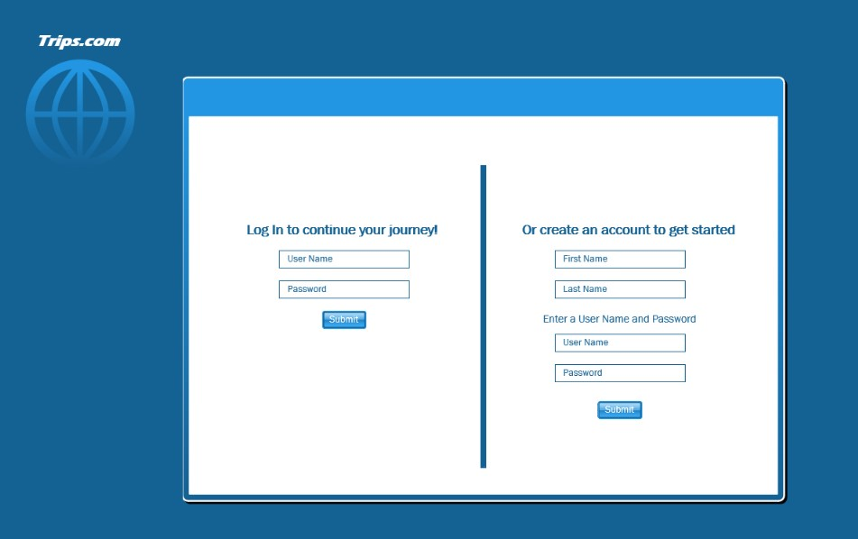
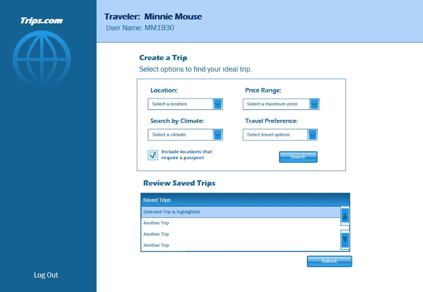

<<<<<<< HEAD
# Group4
hello
=======
# Group4  
**Team Members:** Bobbi Baker, Dawn Brinson, Katherine Piper, Johanna Smith
## Project 2: Trips.com
### Application Overview:
Group 4 will build upon Johanna's "Trip" application and add the following functionality:
 - Convert the application from ADO.Net to EF Core
 - Add an ASP.NET RESTful API
 - Verification of functionality via Swagger
 - Add a customer facing UI using HTML  
 - Add ability to persist data from the UI to a SQL database

### Trips.com UI functionality
 - Create new customer accounts
 - Customer login
 - Search Trips
 - Review and update a customer's saved trips
 - Review and update a customer's profile
 - Delete a customer's saved trip

>>>>>>> origin/main
